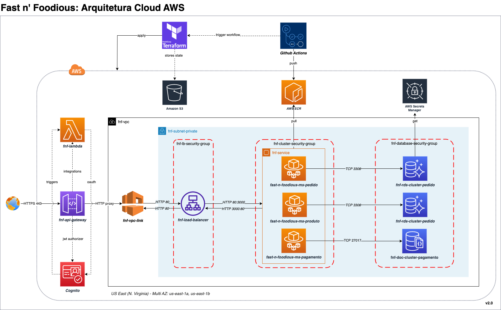

 

 

# 🔠Fast & Foodious - IaC 
Sistema de auto-atendimento de fast food. Projeto de conclusão da Fase 03 da pós gradução em Software Architecture.




## Módulo IaC: Compute
Repositório de criação de infraestrutura cloud AWS, responsável por criar os seguintes recursos:

```
fast-n-foodious-iac-compute
├── fnf-api-gateway.tf                          # Definição de recurso API Gateway, com registro de rotas e controle de acesso de recursos
├── fnf-cognito.tf                              # Definição de recurso Cognito, para registro de usuários destinados a controle de acesso, autenticação e autorização
├── fnf-ecs.tf                                  # Definição de recurso cluster ECS gerenciado com Fargate
├── fnf-iam.tf                                  # Definição de recursos Roles, polices e permissões
├── fnf-lambda-authorizer.js                    # Lambda destinado a autorização de acesso aos recursos da API
├── fnf-lambda-axios-layer.zip                  # Layer axios, utilizada como dependância lambda
├── fnf-lambda-create-user.js                   # Lambda destinada a criação de novos usuários no Cognito
├── fnf-lambda-pre-signup.js                    # Lambda utilizada como trigger do evento Cognito (Pre Sign-Up), responsável por cadatrar novos clientes
├── fnf-lambda-pre-token-authorizer.js          # Lambda utilizada como trigger do evento Cognito (Pre Token Generation), responsável por sobrescrever claims jwt
├── fnf-lambda.tf                               # Definição de recursos Lambdas
├── main.tf                                     # Definição de terraform providers e backend 
├── outputs.tf                                  # Definição de terraform outputs, necessários em módulos externos
└── remote.state.tf                             # Definição de terraform remote state, necessário no módulo local
```